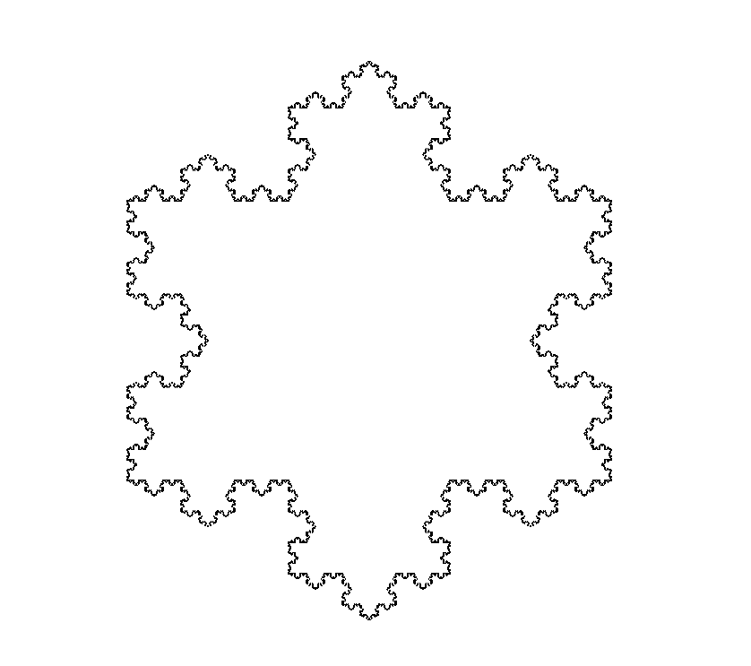

# Rusty fractals

I'm learning rust ! This is a Koch snowflake visualizer !

Keyboard commands:
- directional arrows: move the flake up,down,left,right
- page up, page down: increase the flake resolution.

Performance-wise, I'm able to handle 13k line segments before the display stop feeling perfectly reactive. I should be able to go further by caching some parts of the computation, or restricting the flake computation to the visible area